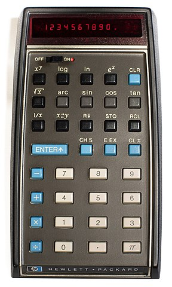
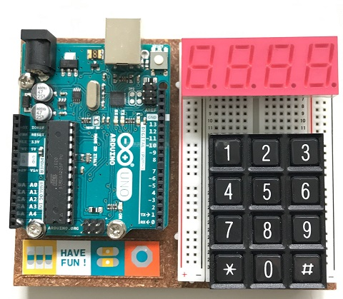

# HP-35 Scientific Calculator Project

The HP-35 was Hewlett-Packard's first pocket calculator and the world's first scientific pocket calculator. Read more on [Wikipedia](https://en.wikipedia.org/wiki/HP-35).

## Project Assignment

The goal of this project is to reverse engineer the functionality of the HP 35 calculator as a React application. A starter set of main components for application logic and user interface is provided. 

## Working with the HP-35

The HP-35 works differently from most other (scientific) calculators that you may come across. Specifically, there are no parentheses keys `(` and `)` for working with algebraic expressions. Instead, the HP-35 uses [Reverse Polish Notation](https://en.wikipedia.org/wiki/Reverse_Polish_notation), more often simply referred to as **RPN**. RPN _"is a mathematical notation in which operators follow their operands."_ A _stack_ is used to store intermediate results.

Recommended viewing on YouTube:

- [The Joys of RPN](https://youtu.be/cPKg_JtI-Ys)
- [Reverse Polish Notation and The Stack - Computerphile](https://youtu.be/7ha78yWRDlE)

Review the HP-35 original manual:

- [HP-35 Instruction Manual](http://www.cs.columbia.edu/)

Experiment with a fully worked out example of this project: 

- https://hp35-calc.netlify.app

## Implementation Details

When trying to rebuild a physical device such as the HP-35 in software a useful first approach is to try and follow the design of the hardware. In the case of the HP-35, the main hardware components are:

1. Keypad
2. Display
3. Control logic (execute calculations)

If we would try and build a hardware HP-35 with an Arduino board it might look like this:

This same architecture can be found in the starter application. For the Keypad and Display there are corresponding `<Keypad>` and `<Display>` React components. For implementing the control logic a `MasterController` ES6 class is provided.

For state management [redux](https://redux.js.org/) will be used.

CSS styling will be done using [styled-components](https://styled-components.com/). 

Correct functioning of the control logic should be demonstrated with appropriate unit tests (examples provided). Unit testing of the user interface is optional.

The control logic (`MasterController` and any of its subcomponents) should be implemented in pure JavaScript without any external dependencies (no imports of React, redux). The user interface should be connected to the control logic using redux actions and state.

Although the app should implement the HP-35 functionality as specified in the HP-35 Instruction Manual, it should _not_ try and mimic the retro-look of the original HP-35. Instead a modern design should be used that favors functionality over form.

The standard JavaScript `Number` should be used, including where needed, its [exponential notation](https://developer.mozilla.org/en-US/docs/Web/JavaScript/Reference/Global_Objects/Number/toExponential).

### RPN stack

You'll find some hints on how to elegantly handle the RPN stack in your application [here](./docs/RPN-stack.md).
